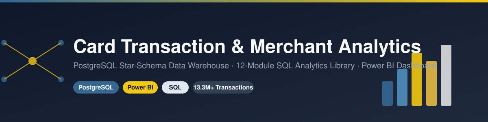
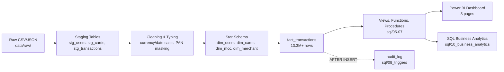

<div align="center">



[](LICENSE)


*13.3M+ credit-card transactions, modeled as a governed star schema and delivered through a three-page executive dashboard.*

</div>

---

## Contents

1. [Project Overview](#1-project-overview) · 2. [Architecture](#2-architecture) · 3. [Dashboard](#3-dashboard) · 4. [Tech Stack](#4-tech-stack) · 5. [Folder Structure](#5-folder-structure) · 6. [Database Schema](#6-database-schema) · 7. [ETL Workflow](#7-etl-workflow) · 8. [Business Questions Solved](#8-business-questions-solved) · 9. [KPIs](#9-kpis) · 10. [Dashboard Pages](#10-dashboard-pages)
11. [Installation](#11-installation-guide) · 12. [Running the Project](#12-running-the-project) · 13. [SQL Scripts](#13-sql-scripts) · 14. [Power BI Setup](#14-power-bi-setup) · 15. [Documentation Links](#15-documentation-links) · 16. [Future Improvements](#16-future-improvements) · 17. [Lessons Learned](#17-lessons-learned) · [Community](#community--contributing) · 18. [Acknowledgements](#18-acknowledgements) · 19. [License](#19-license)

---

## 1. Project Overview

This project turns a raw, 13.3-million-row credit-card transaction dataset into a governed PostgreSQL data warehouse and a three-page Power BI dashboard. It answers the questions a merchant-analytics or card-operations team actually asks: where does spend concentrate, who are the highest-value customers, which payment channels dominate, and how reliable is the transaction pipeline itself.

It was originally scoped as a broader "Personal Finance Analytics & Budget Intelligence System" — a system that would also track income, budgets, savings rate, and a financial health score. Partway through the build, it became clear the sourced dataset has **no income stream, no budgets, and no linked bank-account data** — only card transactions, cardholders, cards, and merchants. Rather than fabricate business data to fit the original pitch, the project was formally repositioned around what the data actually supports. That decision, and the full reasoning behind it, is documented in [`docs/00_PRD_Scope_Addendum.md`](docs/00_PRD_Scope_Addendum.md) — it's arguably as much a part of this portfolio piece as the SQL itself, since recognizing and correcting scope drift honestly is a real analytics-engineering skill.

**Elevator pitch:** *A production-style PostgreSQL data warehouse and Power BI analytics platform that transforms 13.3 million raw card transactions into merchant, customer, payment-channel, and transaction-reliability intelligence — built end-to-end with a documented star schema, a 12-module SQL analytics library, and a three-page executive dashboard.*

---

## 2. Architecture



Full entity-relationship diagram, layer-by-layer architecture explanation, and every design decision (why a surrogate key was needed for `dim_merchant`, why staging is untyped, why currency is `NUMERIC` not `FLOAT`, etc.) live in **[`docs/14_ER_Diagram_Architecture.md`](docs/14_ER_Diagram_Architecture.md)**. The importable schema for [dbdiagram.io](https://dbdiagram.io) is at [`docs/erd/schema.dbml`](docs/erd/schema.dbml).

---

## 3. Dashboard

Three Power BI pages, each built for a different audience. Full visual-by-visual analysis, business insights, and a design review (with scores and known issues) are in **[`docs/15_Dashboard_Documentation.md`](docs/15_Dashboard_Documentation.md)**.

| Executive Overview | Customer Analytics | Transaction Analytics |
|---|---|---|
|  |  |  |

> **Known issues, documented rather than hidden:** the Monthly Revenue/Transactions trend charts currently show a data-model anomaly (a value trapped in a `(Blank)` date bucket), one KPI card on the Transaction Analytics page is mislabeled, and the Average Transaction card overflows its display. All three are tracked in [`dashboard/README.md`](dashboard/README.md#known-issues-flagged-in-the-write-up-not-yet-fixed-in-the-pbix).

---

## 4. Tech Stack

| Layer | Technology | Why |
|---|---|---|
| Database | PostgreSQL | Free, industry-standard, strong window-function support |
| Modeling | Star schema (Kimball) | Shallow joins, predictable BI-tool performance |
| ETL / Transform | SQL (staging → load scripts), Python (`pandas`, for `scripts/load_mcc.py`) | No external orchestration needed at this data volume |
| BI / Dashboard | Power BI Desktop | Industry-standard, free, recruiter-recognized |
| Diagramming | dbdiagram.io (DBML) + Mermaid | Importable ERD + GitHub-native rendering |
| Version Control | Git + GitHub | Commit history as evidence of process |
| Documentation | Markdown | GitHub-native rendering, zero tooling overhead |

---

## 5. Folder Structure

```
personal-finance-analytics/
├── README.md                     # this file
├── LICENSE                       # MIT
├── data/raw/                     # source CSV/JSON (see §9 for what's actually used)
├── dashboard/
│   ├── Personal_Finance_Analytics.pbix
│   └── README.md
├── screenshots/                  # dashboard captures referenced throughout the docs
├── profiling/                    # column-level EDA notes (users, cards, transactions)
├── scripts/
│   └── load_mcc.py               # loads mcc_codes.json into dim_mcc
├── sql/
│   ├── 01_ddl/                   # staging table + star schema DDL
│   ├── 03_load/                  # staging → dimension → fact load scripts
│   ├── 04_indexes/                # performance indexes
│   ├── 05_views/                 # transaction & KPI views
│   ├── 06_functions/             # scalar SQL functions
│   ├── 07_procedures/            # maintenance procedures
│   ├── 08_triggers/               # audit_log trigger
│   ├── 09_testing/                # row-count, duplicate-key, orphan-record, view/function tests
│   ├── 10_business_analytics/     # 12 business-analytics query modules
│   ├── 10_security/                # role-based access (admin/analyst/readonly)
│   └── 11_dashboard_views/         # views built specifically for Power BI consumption
└── docs/
    ├── 00_PRD_Scope_Addendum.md    # the scope-pivot decision record — start here
    ├── 01–13                       # project overview, requirements, dataset, design, ETL,
    │                                 SQL analysis, insights, KPIs, architecture, star schema,
    │                                 query optimization, conclusion
    ├── 14_ER_Diagram_Architecture.md
    ├── 15_Dashboard_Documentation.md
    ├── 16_Portfolio_Positioning.md
    ├── 17_Documentation_Audit.md
    ├── 18_Technical_Validation.md
    ├── erd/schema.dbml
    └── Archive/                    # the original pre-pivot PRD and superseded docs, kept verbatim
```

*(Two legacy items exist and are safe to ignore: `folder_structure.txt` is a stale snapshot from an earlier project layout, and there's a numbering collision between `sql/10_business_analytics/` and `sql/10_security/` — both flagged in [`docs/17_Documentation_Audit.md`](docs/17_Documentation_Audit.md) rather than silently fixed.)*

---

## 6. Database Schema

Star schema, transaction grain (1 row = 1 card transaction):

| Table | Type | Grain |
|---|---|---|
| `dim_users` | Dimension | 1 row = 1 user (~2,000) |
| `dim_cards` | Dimension | 1 row = 1 physical card (~6,146) |
| `dim_mcc` | Dimension | 1 row = 1 Merchant Category Code (~109) |
| `dim_merchant` | Dimension | 1 row = 1 distinct merchant location (surrogate-keyed) |
| `fact_transactions` | Fact | 1 row = 1 transaction (13.3M+) |
| `audit_log` | Audit | 1 row = 1 insert event on `fact_transactions` |

See [`docs/14_ER_Diagram_Architecture.md`](docs/14_ER_Diagram_Architecture.md) for the full ER diagram and every relationship's business rationale, and [`docs/04_Data_Dictionary.md`](docs/04_Data_Dictionary.md) for column-level definitions.

---

## 7. ETL Workflow

```
data/raw/*.csv, mcc_codes.json
        │
        ▼
Staging (stg_users, stg_cards, stg_transactions) — untyped, 1:1 mirror of source
        │
        ▼
Cleaning & typing — strip currency symbols, cast TEXT→NUMERIC/DATE/BOOLEAN, mask card PAN to last 4
        │
        ▼
Dimension load (sql/03_load/01_load_dimensions.sql) — dim_users, dim_cards, dim_mcc, dim_merchant
        │
        ▼
Fact load (sql/03_load/02_load_transactions.sql) — fact_transactions, joined via IS NOT DISTINCT FROM
        │                                            to correctly retain NULL-state/zip online transactions
        ▼
Validation — row-count reconciliation, orphan-key checks (see docs/18_Technical_Validation.md)
        │
        ▼
Views, functions, procedures (sql/05–07) → SQL Business Analytics (sql/10_business_analytics) → Power BI
```

Full narrative walkthrough: [`docs/06_ETL_Process.md`](docs/06_ETL_Process.md).

---

## 8. Business Questions Solved

The full traceability matrix (which question is answered, by which script, and which were explicitly descoped for lack of data) lives in [`sql/10_business_analytics/12_business_questions.sql`](sql/10_business_analytics/12_business_questions.sql). Highlights:

- Which merchant categories and merchants drive the largest share of spend, and how concentrated is it (80/20)?
- How does spend differ on weekends vs. weekdays?
- Which payment channels (swipe / chip / online) are used most, and how has that mix shifted over time?
- Who are the highest-spending customers, and how should they be segmented?
- What does month-over-month and year-over-year spend growth look like?
- What share of transactions fail, and for what reasons?
- How is revenue distributed geographically?

---

## 9. KPIs

Full catalog with formulas and business rationale: [`docs/09_KPI_Definitions.md`](docs/09_KPI_Definitions.md). Core set:

| KPI | Formula |
|---|---|
| Total Revenue | `SUM(amount)` |
| Net Spend | `Total Spend − Total Refunds` |
| Average Transaction Value | `SUM(amount) / COUNT(transaction_id)` |
| Revenue Growth (MoM/YoY) | `(Current − Previous) / Previous × 100` |
| Category / Merchant / Payment-Method Contribution % | `Segment Spend / Total Spend` |
| Rolling Average | `AVG(revenue) OVER (moving window)` |

**Note on naming:** this dataset has no salary/income stream, so KPIs are deliberately framed as *spend* and *net spend*, not *income* or *savings rate* — see [`docs/09_KPI_Definitions.md`](docs/09_KPI_Definitions.md#11-net-spend) for why.

---

## 10. Dashboard Pages

| Page | Audience | Answers |
|---|---|---|
| **Executive Overview** | Executive sponsor, Finance Director | Total revenue/transactions/customers/cards, monthly trend, top merchant categories, payment-channel mix |
| **Customer Analytics** | Marketing/Growth, Product | Revenue by gender/age/card-brand, income vs. revenue, credit-score distribution, top-20 customers |
| **Transaction Analytics** | Operations, Risk | Success/failure rate, failure-reason breakdown, geographic revenue, monthly transaction trend |

Full page-by-page breakdown (business objective, every visual explained, insights, executive summary, recommendations, design review with scores): [`docs/15_Dashboard_Documentation.md`](docs/15_Dashboard_Documentation.md).

---

## 11. Installation Guide

**Prerequisites:** PostgreSQL 14+, `psql` or a GUI client (DBeaver/pgAdmin), Power BI Desktop (Windows), Python 3.9+ (only needed for `scripts/load_mcc.py`).

```bash
# 1. Create the database
createdb finance_analytics

# 2. Clone the repo and cd into it
git clone <this-repo-url>
cd personal-finance-analytics
```

---

## 12. Running the Project

Run the SQL in this order (from `psql`, connected to `finance_analytics`):

```bash
# Schema
psql -d finance_analytics -f sql/01_ddl/01_staging_tables.sql
psql -d finance_analytics -f sql/01_ddl/02_star_schema.sql

# Load raw CSVs into staging (adjust paths if needed)
psql -d finance_analytics -c "\copy stg_users FROM 'data/raw/users_data.csv' WITH (FORMAT csv, HEADER true);"
psql -d finance_analytics -c "\copy stg_cards FROM 'data/raw/cards_data.csv' WITH (FORMAT csv, HEADER true);"
psql -d finance_analytics -c "\copy stg_transactions FROM 'data/raw/transactions_data.csv' WITH (FORMAT csv, HEADER true);"

# Load MCC reference data
python scripts/load_mcc.py

# Clean currency fields (staging TEXT -> NUMERIC views)
psql -d finance_analytics -f sql/02_cleaning/01_clean_currency_fields.sql

# Populate the star schema
psql -d finance_analytics -f sql/03_load/01_load_dimensions.sql
psql -d finance_analytics -f sql/03_load/02_load_transactions.sql

# Indexes, views, functions, procedures, triggers, security
psql -d finance_analytics -f sql/04_indexes/01_indexes.sql
psql -d finance_analytics -f sql/04_indexes/02_fact_indexes.sql
psql -d finance_analytics -f sql/05_views/01_transaction_views.sql
psql -d finance_analytics -f sql/05_views/02_kpi_views.sql
psql -d finance_analytics -f sql/06_functions/01_financial_functions.sql
psql -d finance_analytics -f sql/07_procedures/01_procedures.sql
psql -d finance_analytics -f sql/08_triggers/01_triggers.sql
psql -d finance_analytics -f sql/10_security/01_roles.sql
psql -d finance_analytics -f sql/11_dashboard_views/01_dashboard_views.sql

# Validate the load
psql -d finance_analytics -f sql/09_testing/01_table_tests.sql
```

Then explore `sql/10_business_analytics/` for the business-analytics query library.

---

## 13. SQL Scripts

| Folder | Contents |
|---|---|
| `01_ddl/` | Staging table + star schema `CREATE TABLE` statements |
| `03_load/` | Staging → dimension and staging → fact population scripts, with row-count and orphan-key validation queries built in |
| `04_indexes/` | Indexes on every FK column plus `txn_date` and `amount` |
| `05_views/` | `vw_transaction_summary`, daily/monthly summaries, merchant/card performance, error breakdown |
| `06_functions/` | Scalar functions: total/average transaction amount, per-user spend, per-merchant sales |
| `07_procedures/` | `sp_refresh_statistics`, `sp_truncate_fact_transactions`, `sp_database_summary` |
| `08_triggers/` | `audit_log` table + `trg_transaction_audit` (fires on every `fact_transactions` insert) |
| `09_testing/` | Row counts, duplicate-PK checks, orphan-record checks, view/function smoke tests |
| `10_business_analytics/` | 12 modules: income→spend reframing, expense, savings→net-spend reframing, cash flow (as net spend), merchant, category, payment, time series, customer segmentation, exception analysis, and the business-question traceability file |
| `10_security/` | `admin_role`, `analyst_role`, `readonly_role` |
| `11_dashboard_views/` | Views purpose-built for Power BI: monthly spend/refund/net-spend, category performance, customer segment, error summary |

---

## 14. Power BI Setup

1. Complete the SQL setup in §12 first.
2. Open `dashboard/Personal_Finance_Analytics.pbix` in Power BI Desktop.
3. Update the PostgreSQL data-source connection (host/port/database/credentials) if they differ from your local defaults.
4. Refresh the model.

Details and known follow-ups: [`dashboard/README.md`](dashboard/README.md).

---

## 15. Documentation Links

| Doc | Covers |
|---|---|
| [`00_PRD_Scope_Addendum.md`](docs/00_PRD_Scope_Addendum.md) | The scope-pivot decision record — read this first |
| [`01_Project_Overview.md`](docs/01_Project_Overview.md) | Positioning: problem, objectives, business value |
| [`02_Business_Requirements.md`](docs/02_Business_Requirements.md) | Scope, requirements, user stories, business rules |
| [`03_Dataset_Description.md`](docs/03_Dataset_Description.md) | Source data profile |
| [`04_Data_Dictionary.md`](docs/04_Data_Dictionary.md) | Column-level reference for every table |
| [`05_Database_Design.md`](docs/05_Database_Design.md) | Database design rationale |
| [`06_ETL_Process.md`](docs/06_ETL_Process.md) | ETL pipeline walkthrough |
| [`07_SQL_Analysis.md`](docs/07_SQL_Analysis.md) | SQL analytics module reference |
| [`08_Business_Insights.md`](docs/08_Business_Insights.md) | Insights derived from the analysis |
| [`09_KPI_Definitions.md`](docs/09_KPI_Definitions.md) | KPI catalog |
| [`10_Project_Architecture.md`](docs/10_Project_Architecture.md) | High-level architecture summary |
| [`11_Star_Schema.md`](docs/11_Star_Schema.md) | Dimensional model explanation |
| [`12_Query_Optimization.md`](docs/12_Query_Optimization.md) | Indexing & SQL performance |
| [`13_Conclusion.md`](docs/13_Conclusion.md) | Project summary |
| [`14_ER_Diagram_Architecture.md`](docs/14_ER_Diagram_Architecture.md) | Full ER diagram, DBML, design decisions |
| [`15_Dashboard_Documentation.md`](docs/15_Dashboard_Documentation.md) | Page-by-page dashboard review |
| [`16_Portfolio_Positioning.md`](docs/16_Portfolio_Positioning.md) | How to present this project to recruiters/interviewers |
| [`17_Documentation_Audit.md`](docs/17_Documentation_Audit.md) | Documentation quality review + action plan |
| [`18_Technical_Validation.md`](docs/18_Technical_Validation.md) | ETL validation, data quality, integrity checks |

---

## 16. Future Improvements

Prioritized in [`docs/14_ER_Diagram_Architecture.md`](docs/14_ER_Diagram_Architecture.md#8-production-readiness-gaps--recommended-improvements) and [`docs/17_Documentation_Audit.md`](docs/17_Documentation_Audit.md). Highlights:

- Add a conformed `dim_date`, an FK from `audit_log` to `fact_transactions`, and partition `fact_transactions` by `txn_date`.
- Fix the dashboard's `(Blank)`-bucket trend anomaly, the mislabeled Failure Rate card, and the Average Transaction display overflow.
- Build the deferred recurring-transaction flag (merchant + amount ±5% + 3-of-4-months) — the one originally-scoped capability this dataset can still support (see [`00_PRD_Scope_Addendum.md`](docs/00_PRD_Scope_Addendum.md#7-deferred-not-descoped)).
- Explore `data/raw/train_fraud_labels.json` (not currently loaded anywhere in the pipeline) as the basis for a future fraud-analytics extension.

---

## 17. Lessons Learned

- **Verify the dataset against the business plan before writing the schema, not after.** The original PRD assumed income and budget data that never existed in the source files; catching that mid-build (rather than fabricating numbers to fit) is the single most reusable lesson from this project.
- **A surrogate key is a design decision with a reason, not a default.** `dim_merchant` needed one because its natural key (`merchant_id`) repeats across locations; every other dimension reused its stable source id instead, because minting a surrogate there would have been ceremony without benefit.
- **`NULL = NULL` is not `TRUE`.** The fact-load join originally used `=` on nullable merchant location columns and silently dropped every online transaction; switching to `IS NOT DISTINCT FROM` fixed it, and a row-count reconciliation query now exists specifically to catch a regression of that class of bug.
- **A dashboard review is not complete until you've compared a filtered screenshot against the default view.** That comparison is what surfaced the mislabeled KPI card and the trend-chart anomaly — issues that don't show up if you only ever look at one static state of each page.

---

## Community & Contributing

Issues and pull requests are welcome — see [`CONTRIBUTING.md`](CONTRIBUTING.md) for how this project is organized and what a good contribution looks like, and [`CODE_OF_CONDUCT.md`](CODE_OF_CONDUCT.md) for participation expectations. Found a real security/data-leak concern (as opposed to a data-modeling limitation)? See [`SECURITY.md`](SECURITY.md) for private disclosure. Project history lives in [`CHANGELOG.md`](CHANGELOG.md); [`RELEASE_NOTES.md`](RELEASE_NOTES.md) carries the narrative v1.0.0 snapshot.

A full pre-publish audit of this repository — folder structure, GitHub presentation, recruiter experience, and a prioritized improvement list — is in [`docs/19_GitHub_Repository_Audit.md`](docs/19_GitHub_Repository_Audit.md).

---

## 18. Acknowledgements

- Source data: a synthetic credit-card transaction dataset (users, cards, transactions, MCC reference data) sourced from Kaggle — see [`docs/03_Dataset_Description.md`](docs/03_Dataset_Description.md) for its documented scope and limitations.
- Built as a self-directed portfolio project; the scope-pivot decision in [`docs/00_PRD_Scope_Addendum.md`](docs/00_PRD_Scope_Addendum.md) was made unprompted upon discovering the dataset/PRD mismatch.

---

## 19. License

[MIT](LICENSE) © 2026 Sunil Kumar
