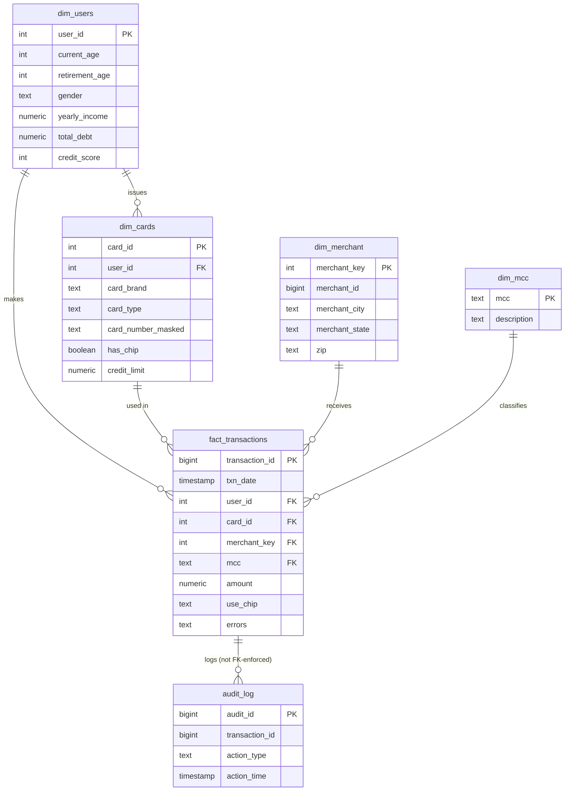
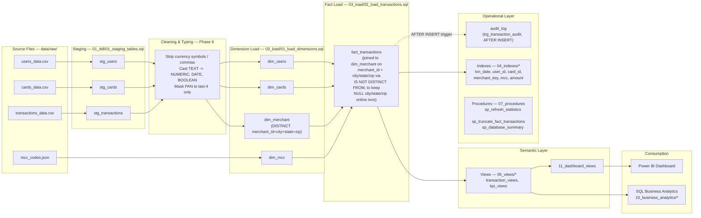

# ER Diagram & Data Warehouse Architecture

# Card Transaction & Merchant Analytics

---

## 0. About This Document

This is the authoritative entity-relationship and architecture reference for the warehouse, produced by analyzing the actual DDL (`sql/01_ddl/`, `sql/03_load/`, `sql/04_indexes/`, `sql/08_triggers/`), not a re-description of intent. It completes Phase 5 (ER Diagram) of the project roadmap.

Two other docs cover overlapping ground and predate this one: [`05_Database_Design.md`](05_Database_Design.md) and [`11_Star_Schema.md`](11_Star_Schema.md). Where they conflict with this document — notably, both describe `stg_transactions` as the fact table and omit `dim_merchant` and `audit_log` entirely — **this document is correct and supersedes them.** They're left as-is pending a separate cleanup pass; see the note at the end of this document.

The importable model lives at [`erd/schema.dbml`](erd/schema.dbml) — paste it into [dbdiagram.io](https://dbdiagram.io) for the interactive diagram. A GitHub-native view is embedded below via Mermaid.

---

## 1. Complete Schema Inventory

| Table | Layer | Grain | Approx. Rows | Primary Key |
|---|---|---|---:|---|
| `stg_users` | Staging | 1 row = 1 source user record | 2,000 | `id` |
| `stg_cards` | Staging | 1 row = 1 source card record | 6,146 | `id` |
| `stg_transactions` | Staging | 1 row = 1 source transaction record | 13.3M+ | `id` |
| `dim_users` | Dimension | 1 row = 1 user | 2,000 | `user_id` |
| `dim_cards` | Dimension | 1 row = 1 physical card | 6,146 | `card_id` |
| `dim_mcc` | Dimension | 1 row = 1 Merchant Category Code | 109 | `mcc` |
| `dim_merchant` | Dimension | 1 row = 1 distinct (merchant_id, city, state, zip) | varies | `merchant_key` (surrogate) |
| `fact_transactions` | Fact | 1 row = 1 card transaction | 13.3M+ | `transaction_id` |
| `audit_log` | Audit | 1 row = 1 INSERT event on `fact_transactions` | grows with load volume | `audit_id` |

---

## 2. Entity-Relationship Diagram



Full DBML: [`erd/schema.dbml`](erd/schema.dbml).

---

## 3. Star Schema Explanation

This is a single-fact, conformed-dimension star schema at **transaction grain** — one row in `fact_transactions` is one card swipe/chip/online transaction, full stop. Every other table hangs off it as a lookup:

```
                          dim_users
                              |
                              | 1:N (user issues many cards)
                              |
  dim_merchant  ── N:1 ──  fact_transactions  ── N:1 ──  dim_cards
                              |
                              | N:1
                              |
                          dim_mcc
```

Why a star rather than a snowball of normalized lookup tables:

- **Shallow joins.** Every business question (spend by user, by card brand, by merchant, by category) is a single join from `fact_transactions` to exactly one dimension. No dimension joins to another dimension.
- **Additive measure, isolated.** `amount` is the only additive fact measure. Everything else is either a foreign key to a conformed dimension (`user_id`, `card_id`, `merchant_key`, `mcc`) or a degenerate dimension kept inline (`use_chip`, `errors`) because it has no further attributes worth a separate table.
- **Grain agreed before SQL.** Per the project's design rule (carried over from the original PRD's NFR-05), `fact_transactions` grain was written down — 1 row = 1 transaction — before any analytical query was built against it. This is what prevents the most common star-schema bug: a fan-out join silently duplicating fact rows because a dimension wasn't actually at the grain you assumed.
- **`dim_merchant` needed a surrogate key precisely because of this discipline.** `merchant_id` alone repeats across physical locations in the source data; if it had been used as the join key directly, joining transactions to merchant city/state/zip would fan out one transaction into multiple rows. `merchant_key` (surrogate, one row per distinct merchant_id + location) is what keeps the fact-to-dimension join 1:1 on the dimension side.

---

## 4. ETL Data Flow (Staging → Dimensions → Fact)



**Notable ETL detail worth knowing cold in review:** the fact load joins `stg_transactions` to `dim_merchant` using `IS NOT DISTINCT FROM` rather than plain `=` on `merchant_city`/`merchant_state`/`zip`. An earlier version used `=`, which silently dropped every online transaction from the fact table — `state`/`zip` are `NULL` for card-not-present transactions, and `NULL = NULL` evaluates to unknown, not true, in SQL's three-valued logic. The row-count reconciliation query at the bottom of `02_load_transactions.sql` (`staging_row_count` vs `fact_row_count`, expecting `dropped_rows = 0`) exists specifically to catch a regression of that bug.

---

## 5. Architecture Explanation

The warehouse is organized into five layers, each with a distinct responsibility:

1. **Source layer** — flat files under `data/raw/` (CSV + JSON). No connectivity, no CDC; static/historical by design (see the project's out-of-scope decisions).
2. **Staging layer** (`stg_*`) — an unconstrained, TEXT-heavy 1:1 mirror of the source files. Its only job is to guarantee a raw load never fails on formatting. No FKs are enforced here on purpose: staging must accept whatever the source produced, so validation is deferred to the promotion step.
3. **Integration / load layer** (`sql/03_load/*`) — casts, cleans, masks, and de-duplicates staging rows into the dimension and fact tables. This is where `TEXT -> NUMERIC/DATE/BOOLEAN` casting happens, where the credit-card PAN is reduced to a masked last-4 (`card_number_masked`), and where `dim_merchant`'s surrogate key is minted via `SELECT DISTINCT`.
4. **Warehouse core** (`dim_*`, `fact_transactions`) — the conformed star schema described in §3, indexed per `sql/04_indexes/*` on every foreign key and on `txn_date`/`amount` for range and aggregate queries.
5. **Operational layer** — cross-cutting concerns that sit alongside the core tables rather than in the query path: `audit_log` + `trg_transaction_audit` (row-level insert auditing), `sp_refresh_statistics`/`sp_truncate_fact_transactions`/`sp_database_summary` (maintenance procedures), and `admin_role`/`analyst_role`/`readonly_role` (`sql/10_security/01_roles.sql`) for access control.
6. **Semantic + consumption layer** — `sql/05_views/*` and `sql/11_dashboard_views/*` expose the star schema as stable, reusable views so that Power BI and the `10_business_analytics/*` SQL library never query raw fact/dimension tables directly.

The load pattern is **full truncate-and-reload** (`sp_truncate_fact_transactions` + re-run the load scripts), not incremental — appropriate for a static historical dataset with no live feed, but a decision that would need revisiting before this design could take live, incrementally-arriving data (see §8, Improvements).

---

## 6. Why Each Relationship Exists

| Relationship | Cardinality | Business reason |
|---|---|---|
| `dim_users.user_id` → `dim_cards.user_id` | 1 : N | A user can hold multiple physical cards (avg. ~3 cards/user in this dataset); card-level attributes (brand, limit, chip) don't belong on the user row. |
| `dim_users.user_id` → `fact_transactions.user_id` | 1 : N | Every transaction is made by exactly one user; this is the join that powers all customer-level spend and segmentation analysis. |
| `dim_cards.card_id` → `fact_transactions.card_id` | 1 : N | Every transaction is charged to exactly one card; this is the join that powers card-brand/type and payment-channel analysis, and is kept separate from `user_id` because a user's spend can be split across several cards. |
| `dim_merchant.merchant_key` → `fact_transactions.merchant_key` | 1 : N | A merchant location receives many transactions. The join is on the surrogate `merchant_key`, not the natural `merchant_id`, because `merchant_id` alone is not unique per location (see §3) — joining on it directly would fan out the fact table. |
| `dim_mcc.mcc` → `fact_transactions.mcc` | 1 : N | Every transaction is classified into exactly one Merchant Category Code; this is the join that stands in for category analysis in the absence of a true category dimension. |
| `fact_transactions.transaction_id` → `audit_log.transaction_id` | 1 : N (logical) | Each insert onto `fact_transactions` fires `trg_transaction_audit`, writing one `audit_log` row per event. **Not currently backed by a DB-level FK constraint** — see §8. |

---

## 7. Data Warehouse Design Decisions

1. **Natural keys carried through as dimension surrogate keys where they're already unique.** `dim_users.user_id`, `dim_cards.card_id`, and `fact_transactions.transaction_id` reuse the source system's id unchanged rather than minting a new `SERIAL`. This is a deliberate Kimball trade-off: a generated surrogate key is standard practice mainly to (a) insulate the warehouse from source-key reuse/collision and (b) support Type-2 history (multiple surrogate rows per natural key). Neither applies here — the source ids are already stable and unique, and the dimensions are Type-1. Reusing them avoids an unnecessary lookup/mapping table.
2. **`dim_merchant` is the one dimension that does need a manufactured surrogate (`merchant_key`, `SERIAL`)**, because its natural key is genuinely composite (`merchant_id` + city + state + zip) and repeats — exactly the case surrogate keys exist for.
3. **Currency stored as `NUMERIC(12,2)`, never `FLOAT`/`DOUBLE`.** Floating-point binary representation cannot represent most base-10 currency values exactly; aggregating millions of transactions in `FLOAT` would accumulate visible rounding error. `NUMERIC` is exact and is the standard choice for monetary data in Postgres.
4. **Staging columns are TEXT even where the target type is numeric/date/boolean.** A `COPY` into a typed column fails the whole batch on the first malformed row (e.g., `"$1,234.56"` into a `NUMERIC` column, or a `"YES"/"NO"` string into `BOOLEAN`). Keeping staging untyped guarantees the raw load always succeeds; casting happens explicitly and visibly in the load scripts, where a bad row can be caught and reported rather than silently rejected by `COPY`.
5. **PAN (card number) never leaves staging in usable form.** `dim_cards.card_number_masked` is derived as `'XXXX-XXXX-XXXX-' || RIGHT(card_number, 4)` at load time; `cvv` is dropped entirely and never promoted past `stg_cards`. This is PCI-DSS-adjacent hygiene even though full compliance work is explicitly out of scope (per the project PRD).
6. **`use_chip` and `errors` are kept as degenerate dimensions on `fact_transactions` rather than broken into their own tables.** Both are low-cardinality attributes with no further descriptive columns of their own — a `dim_payment_channel` table with 3 rows would add a join for no query benefit. This is a standard Kimball degenerate-dimension call, not an oversight.
7. **No Type-2 SCD on `dim_users` or `dim_cards`.** Both are Type-1 (overwrite-on-reload): a user's `credit_score`, `yearly_income`, or `total_debt`, and a card's `credit_limit`, are always shown as of the latest load, with no history of prior values. Acceptable for a static historical dataset with a single load; would need to change if the warehouse ever tracked a user/card over multiple loads (see §8).
8. **Indexing follows the query shape, not a blanket "index everything."** `fact_transactions` is indexed on every FK column used in dimension joins (`user_id`, `card_id`, `merchant_key`, `mcc`) plus `txn_date` (range scans for time-series analysis) and `amount` (used directly in several `WHERE`/`ORDER BY` clauses in `10_business_analytics/*`). `dim_merchant` carries a composite lookup index on its natural key columns to support the fact-load join described in §4.
9. **Referential integrity is enforced with real FK constraints** (`REFERENCES`) from `dim_cards`, and from `fact_transactions` to all four dimensions — not just documented in prose. The load scripts additionally run explicit orphan-detection queries (`orphan_users`, `orphan_cards`, `orphan_merchants`, `orphan_mcc` in `02_load_transactions.sql`) as a belt-and-suspenders check beyond what the constraints alone guarantee at load time.
10. **Auditing is event-driven, not batch-reconciled.** `trg_transaction_audit` fires per-row on `INSERT` rather than relying on a nightly diff job, so `audit_log` reflects load activity in real time. The trade-off is the FK gap noted in §8.

---

## 8. Production-Readiness Gaps & Recommended Improvements

Ranked by what a Fortune-500 review would flag first:

**High priority**
- **`audit_log.transaction_id` has no FK constraint.** It's populated correctly by the trigger, but nothing stops it from referencing a `transaction_id` that's since been deleted, or from being loaded independently with a bad value. Add `REFERENCES fact_transactions(transaction_id)`.
- **No date dimension (`dim_date`).** Every query that needs month/quarter/weekend flags derives them inline from `txn_date` (`EXTRACT`, `DATE_TRUNC`, etc.), repeated across the `10_business_analytics/*` library. A conformed `dim_date` would centralize that logic, guarantee every report defines "weekend" and "quarter" identically, and let Power BI use a proper time-intelligence relationship instead of calculated columns.
- **`fact_transactions` is a single unpartitioned table at 13.3M+ rows.** At this scale and with `txn_date`-range queries as the dominant access pattern, native Postgres declarative partitioning by `txn_date` (e.g., yearly or quarterly range partitions) would materially improve prune-and-scan performance and make the truncate/reload maintenance operation partition-swappable instead of a full-table operation.

**Medium priority**
- **Type-1-only dimensions lose history.** If this warehouse ever ingests a second load cycle, a user's changed `credit_score` or a card's changed `credit_limit` silently overwrites the prior value with no trail. Promoting `dim_users`/`dim_cards` to Type-2 (effective-dated rows, `is_current` flag) would be the standard fix if historical trend analysis on those attributes ever becomes a requirement.
- **`dim_merchant`'s natural key is enforced only by a non-unique index, not a `UNIQUE` constraint.** `idx_dim_merchant_lookup` speeds up the load-time lookup but doesn't stop a reload from inserting duplicate `(merchant_id, city, state, zip)` rows outside the current `SELECT DISTINCT` load path. A `UNIQUE` constraint on that column tuple would make the invariant enforced, not just conventionally true.
- **No category dimension beyond flat MCC codes.** `dim_mcc` is a 2-column lookup (code → description) with no hierarchy (parent category / is-discretionary flag). Fine for this dataset's scope, but worth naming explicitly as a simplification rather than a full category dimension, since "category analysis" in the docs currently means "MCC analysis."
- **Load strategy is full truncate-and-reload (`sp_truncate_fact_transactions`), not incremental.** Appropriate for a static one-time historical load; would need an upsert/CDC-based incremental load (keyed on `transaction_id`) before this design could support a recurring or near-real-time feed.

**Lower priority / hygiene**
- **Security roles are broad, not column-aware.** `analyst_role` gets `SELECT, INSERT, UPDATE` on *all* tables in the schema, including PII-bearing columns in `dim_users` (`address`, `latitude`, `longitude`, `yearly_income`, `total_debt`, `credit_score`). Production-grade access control would scope PII columns behind a view or column-level grant rather than table-level `ALL`.
- **No load lineage/batch tracking on staging.** `stg_*` tables have no `load_batch_id`/`load_timestamp` column, so two successive loads are indistinguishable in the data itself — fine for a single historical load, a gap the moment there's more than one.
- **`fact_transactions.amount` has no `CHECK` constraint.** `NOT NULL` is enforced, but nothing bounds it against, say, an absurd magnitude value from a source data-entry error; a sanity-range `CHECK` is cheap insurance.

**Documentation hygiene (not schema, but related):** [`05_Database_Design.md`](05_Database_Design.md) and [`11_Star_Schema.md`](11_Star_Schema.md) currently describe `stg_transactions` as the fact table and don't mention `dim_merchant` or `audit_log` at all — both should be corrected to match this document rather than left to drift further.

---

## 9. Interview Explanation (Under 3 Minutes)

> *"This is a star-schema data warehouse built in PostgreSQL on top of a 13-million-row credit-card transaction dataset. I've got one fact table — `fact_transactions`, transaction grain, one row per card swipe — surrounded by four conformed dimensions: users, cards, merchants, and merchant-category codes.*
>
> *The interesting design decision is in the merchant dimension. The source data's merchant_id isn't actually unique — the same merchant recurs at multiple locations — so I had to build a surrogate key, `merchant_key`, over the natural composite of merchant_id plus city, state, and zip. That's a textbook case for why surrogate keys exist: without it, joining transactions to merchant location would silently fan out and double-count spend. Everywhere else, I kept the source system's own ids as the dimension keys, because they're already unique and I'm not tracking dimension history — minting a new surrogate there would've been ceremony without benefit.*
>
> *Below the star schema there's a staging layer that's deliberately untyped — every column is TEXT — because a COPY into a typed column fails the whole load on the first malformed row, and this source data has currency strings and MM/YYYY dates that need explicit cleaning. That cleaning step is also where I mask the card PAN down to last-4 and drop the CVV entirely, since neither has any business being in an analytics warehouse even in a portfolio project.*
>
> *On top of the core tables there's an operational layer — an insert-triggered audit log, maintenance procedures, and role-based access — and a semantic layer of views so Power BI and the SQL analytics library never touch the raw fact table directly.*
>
> *If I were taking this to production, the first three things I'd fix are: add the missing FK from the audit log back to the fact table, partition the fact table by transaction date since it's already at 13 million rows, and build a proper date dimension instead of deriving month/quarter/weekend inline in every query — that last one's really about guaranteeing every report defines 'weekend' the same way."*

---

## 10. Next Steps

- Import [`erd/schema.dbml`](erd/schema.dbml) into dbdiagram.io and export a PNG/SVG for the README/portfolio screenshots (Phase 13).
- Decide whether to act on the High-priority items in §8 before packaging the repo for GitHub, or explicitly carry them forward as documented "known limitations" (the PRD's own risk-mitigation pattern — see [`00_PRD_Scope_Addendum.md`](00_PRD_Scope_Addendum.md)).
- Optionally correct `05_Database_Design.md` and `11_Star_Schema.md` to remove the `stg_transactions`-as-fact-table and missing-`dim_merchant`/`audit_log` inaccuracies flagged in §8.
